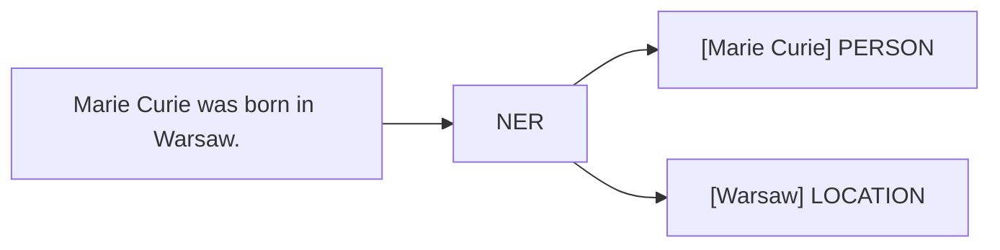

<p align="center"><b>anno</b></p>



Information extraction for Rust: named entities, coreference, discourse.

Dual-licensed under MIT or Apache-2.0.

```sh
# CLI
anno extract --text "Marie Curie was born in Warsaw."

# Library
use anno::{Document, extract_entities};

let doc = Document::new("Marie Curie was born in Warsaw.");
let entities = extract_entities(&doc);
```

## Crates

| Crate | Purpose |
|-------|---------|
| `anno` | Main library + CLI |
| `anno-core` | Core types (Entity, Document) |
| `anno-strata` | Graph algorithms (Leiden, Louvain) |

## Features

- Named entity recognition (NER)
- Coreference resolution
- Discourse analysis (shell nouns, anaphora)
- Multiple backends (ONNX, Candle, Burn)

## Documentation

- [`docs/QUICKSTART.md`](docs/QUICKSTART.md) — getting started
- [`docs/BACKENDS.md`](docs/BACKENDS.md) — ML backend configuration
- [`docs/EVALUATION.md`](docs/EVALUATION.md) — evaluation datasets
